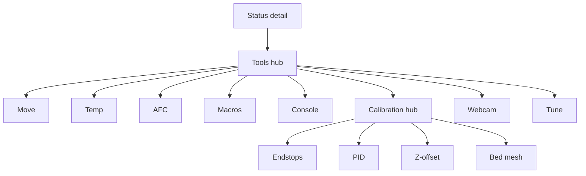
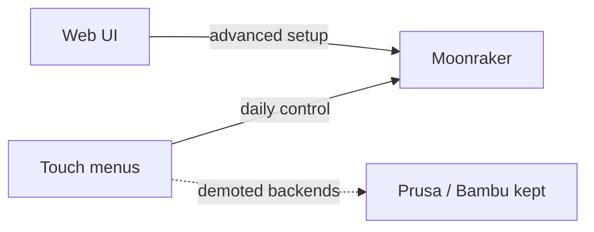

# K-Touch menus-first roadmap

## Reality check

Stock K-Touch was never open-sourced. Spec: docs + [firmware-backup](firmware-backup/) binaries. We reimplement over Moonraker on this open tree — no decompile.

## Product priorities (locked)

1. **Menus first** — Tools hub → dedicated screens; never pack all controls on one page.
2. **Placeholders OK** — Unfinished entries open a screen that says **Coming soon** (and Back). Ship the IA before the depth.
3. **Klipper/Moonraker first** on the touch UI.
4. **Keep Prusa + Bambu code** — leave `prusa_connect.c` / `prusalink.c` / `bambu*.c` compiled and reachable; demote in add-printer / Tools (hide Klipper-only entries when backend is not Moonraker). Treat as an afterthought, not a rewrite target.
5. **LAN network scan** — **deferred** (not M1–M3). Manual host/port stays.
6. **Hard / fiddly setup → web UI** — multi-camera pick, LED/neopixel mapping, similar config. Touch = day-to-day control; web = setup lab.

Today’s crowded [`build_control_screen`](firmware/main/ui.c) becomes the **Tools hub** (list of rows only). Child screens hold real UI or a centered **Coming soon** label.

## Inventory (abbrev)

| Area | Status | Notes |
|---|---|---|
| Fleet / files / Wi‑Fi / OTA | Have | Keep |
| Packed Control | Replace | → Tools hub |
| Move / Temp / Webcam | Partial | Migrate existing widgets to own screens in M1 |
| AFC change/unload | Partial | Own screen in M1; deeper actions Coming soon then M2 |
| Console / Macros / Calibration / Tune | Missing | Menu + Coming soon in M1; fill later |
| E-stop / fault page | Missing | Chrome in M1; full fault page later |
| LAN scan | Deferred | Explicitly later |
| Multi-cam / LED assign | Web-only | Not on touch |
| Prusa / Bambu | Keep code | Demoted UX |
| Panda PWR / battery HW | Skip | |

---

## Milestone 1 — Menu shell + placeholders (implement next)

Goal: navigation feels like a real K-Touch-style menu tree; no regressions on what already works; unfinished = Coming soon.

### Tools hub
- Scrollable menu rows: **Move**, **Temperature**, **Webcam**, **Macros**, **Console**, **Tune**, **Calibration**; **AFC** only if `afc.present` (Moonraker).
- No inline jog/preheat/AFC/webcam cards on the hub.
- Back from children → Tools; Tools ← Status (existing Control entry point becomes Tools).

### Migrate existing (so M1 is usable)
- **Move** — current jog + home (fixed step OK for now).
- **Temperature** — current preheat presets.
- **Webcam** — current snapshot viewer.
- **AFC** — current lane change + unload (show all lanes up to 8 if easy; else keep working 4 and note deeper Coming soon on same screen as secondary section).

### Placeholders (Coming soon screen helper)
Shared tiny builder: title + “Coming soon” + Back. Wire:
- Macros, Console, Tune
- Calibration hub entries: Endstops, Auto PID, Z-offset, Bed mesh
- Optional AFC extras strip: Eject / Move filament / Prep / Resume / Clear → Coming soon until M2

### E-stop chrome
- Confirm → `POST /printer/emergency_stop` for Moonraker; on Prusa/Bambu either hide or Coming soon / best-effort later — **do not break those backends**.

### Explicitly not in M1
- LAN scan
- Real console/macros/calibration logic
- Web multi-cam / LED setup (stub section title on web OK, or skip until M4)
- Removing or `#ifdef`-stripping Prusa/Bambu

---

## Milestone 2 — Fill Klipper depth behind menus

Replace Coming soon for: Console (`gcode_store` + send), Macros (gcode/help + prefs pins), AFC eject/move/prep/resume/clear, Move/Temp extras (fan, unlock, extrude, step sizes, M220/M221).

## Milestone 3 — Calibration + fault page

Fill Calibration children; Klipper error screen with `RESTART` / `FIRMWARE_RESTART`. Still no LAN scan.

## Milestone 4 — Web advanced setup

Web UI panels for: multiple cameras (pick default for touch snapshot), LED / neopixel assignment, other dense config. Touch only consumes the chosen defaults.

## Later

- LAN Moonraker scan on :7125
- Optional home widgets / clock
- Network-only Panda PWR if ever desired

---

## Prusa / Bambu policy

- **Keep** all existing modules and fleet behavior.
- Tools menu: show only entries that make sense for the active backend (e.g. hide Console/Macros/AFC/Calibration on Prusa/Bambu, or show Coming soon).
- No milestone is “rebuild Prusa/Bambu UI”; fixes only if something regresses.

## Primary files (M1)

- [`firmware/main/ui.c`](firmware/main/ui.c) / [`ui.h`](firmware/main/ui.h) — hub, child screens, placeholder helper, estop chrome
- [`firmware/main/moonraker.c`](firmware/main/moonraker.c) / [`.h`](firmware/main/moonraker.h) — estop only for new API in M1
- [`firmware/main/app_state.c`](firmware/main/app_state.c) / [`.h`](firmware/main/app_state.h) — `PP_CMD_ESTOP`
- [`firmware/main/i18n.h`](firmware/main/i18n.h) / [`i18n.c`](firmware/main/i18n.c) — Tools / Coming soon strings

## Out of scope until listed milestone

- Deleting Prusa/Bambu, LAN scan, Panda PWR, decompiling `product.img`, temp graphs
