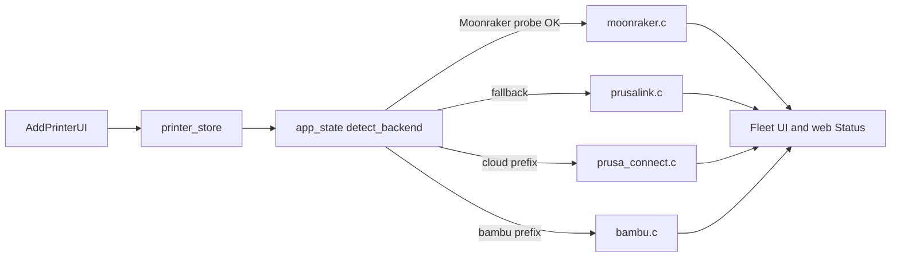

# Klipper-first rebrand (keep Prusa/Bambu)

**Default brand:** product name **Klipper Touch**, AP SSID `KlipperTouch-XXXX`, web title/header accordingly. Binary/CMake rename can follow in the same pass (`klipper-touch` / `klipper-touch-app.bin`) so OTA docs stay consistent; leave `PP_*` / `pandaprusa.h` symbols as-is for now (mechanical rename is a later cleanup, not required for the product shift).

## Goals

- Adding a Klipper printer “just works” (host + port 7125, optional API key).
- First-run / add-printer UX leads with Moonraker; Prusa and Bambu remain available further down.
- No Prusa Connect branding as the hero identity.
- Do **not** delete `prusa_connect.c`, `prusalink.c`, or `bambu*.c`.

## Phase 1 — Fix Moonraker onboarding (functional)

Critical bug today: [`firmware/main/web.c`](firmware/main/web.c) `printers_post` always sets `p.port = 80` and does not split `host:port`, so Moonraker never gets 7125.

- Parse `host:port` (and IPv6-safe cases if already handled elsewhere) on printer create/update in `web.c`.
- When add type is Klipper / no explicit port: default **7125**; PrusaLink keeps **80**; Bambu keeps its prefix scheme.
- Persist detected backend after `moonraker_probe()` succeeds in [`firmware/main/app_state.c`](firmware/main/app_state.c) so a temporarily unreachable Moonraker is not permanently stuck as PrusaLink.
- Update Kconfig seed in [`firmware/main/Kconfig.projbuild`](firmware/main/Kconfig.projbuild): Moonraker-oriented host/port defaults (7125), menu title not “Prusa-Touch Configuration”.

## Phase 2 — Klipper-first UX (demote, don’t remove)

**Web** ([`firmware/main/web.c`](firmware/main/web.c) embedded HTML):

- Reorder add-printer picker: **Klipper (Moonraker)** first / recommended; Local PrusaLink and Cloud (Prusa Connect / Bambu) after.
- Relabel Status/Printers copy to be backend-neutral; keep Accounts + Prusa Farm tabs but not as the primary story.
- Wire web Status pause/resume/stop through the shared `app_state` command path for the selected printer (not Connect-UUID-only), so Klipper is controllable from the web UI too.

**Touch** ([`firmware/main/ui.c`](firmware/main/ui.c)):

- Neutral fallback model string (not `"Prusa printer"`).
- Prefer Fluidd/Klipper model art when model contains Klipper; leave Prusa SVGs for Prusa printers.
- Keep Farm / Connect session banners only when a Connect printer exists (no need to remove).

## Phase 3 — Rebrand surfaces

| Surface | Change |
|---|---|
| Skin defaults | [`firmware/main/skin.c`](firmware/main/skin.c): wordmark → `KLIPPER \| TOUCH` (or similar), byline update |
| Theme accents | Soften Connect-orange primacy only if skin defaults already encode it; keep theme editor working |
| Web title/header | “Klipper Touch” in `web.c` |
| SoftAP | [`firmware/main/wifi.c`](firmware/main/wifi.c): `KlipperTouch-%02X%02X` |
| About / OTA UA | [`firmware/main/ui.c`](firmware/main/ui.c), [`firmware/main/ota_update.c`](firmware/main/ota_update.c): product name; point `PP_UPDATE_REPO` default at this fork when you publish releases |
| Build artifacts | [`firmware/CMakeLists.txt`](firmware/CMakeLists.txt) `project(klipper-touch)`; [`.github/workflows/release.yml`](.github/workflows/release.yml) `klipper-touch-full.bin` / `klipper-touch-app.bin`; web OTA upload copy |
| Docs | [`README.md`](README.md), [`docs/API.md`](docs/API.md): Klipper-first install + Moonraker add; note Prusa/Bambu still supported |

## Phase 4 — Moonraker depth (same milestone if time allows)

In [`firmware/main/moonraker.c`](firmware/main/moonraker.c):

- File thumbnails via Moonraker metadata (`/server/files/metadata` → thumbnails).
- Optional webcam snapshot path already used by UI for Connect — map a Moonraker webcam URL when configured.
- Keep ETA estimation if Moonraker doesn’t provide a clean ETA; improve if `estimate`/`print_duration` available.

## Out of scope (explicit)

- Deleting or `#ifdef`-stripping Prusa/Bambu modules.
- Renaming every `PP_*` / `pandaprusa.*` identifier.
- Custom bootloader work (stock IDF + dual OTA stays).

## Verification

- Flash app image (or full) to the unit at `10.0.0.242`.
- Add Moonraker printer as `host:7125` from web; confirm status/temps/files/pause-resume on touch **and** web Status.
- Confirm Prusa Connect / Bambu / PrusaLink entries still appear in the demoted picker and still compile.
- SoftAP name and web header show Klipper Touch after wipe/reflash or prefs reset as applicable.

