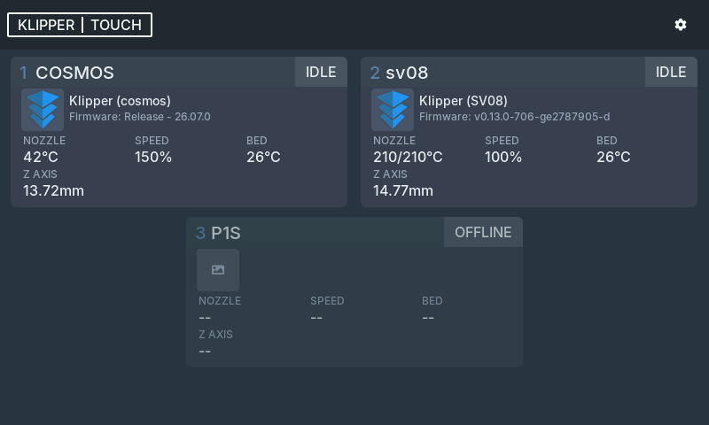

# Klipper Touch

A community touchscreen for your 3D printers, built on the **BigTreeTech K-Touch** (5")
and **Panda Touch**. Point it at Moonraker (Fluidd / Mainsail / OpenCentauri, etc.) over
your LAN — no companion app. Optional Bambu (and legacy Prusa) backends remain in the
add-printer list if you need them.

> Community fork of earlier Prusa-oriented touchscreen firmware.
> **Not affiliated with BigTreeTech or Prusa Research.**



More in the **[screenshot gallery](docs/screenshots.md)** — printer detail, control, the guided
add-a-printer flow, screen lock, and portrait layouts. (All rendered from the firmware's own UI
with the desktop simulator.)

## What it does

- **Fleet home.** The dashboard is the default screen: every printer at a glance (state,
  temperatures, progress, model render, live gcode thumbnail). Tap a printer to open it;
  Settings lives behind a header gear — no bottom nav bar.
- **Printer view.** Status badge, nozzle / heatbed / speed / Z, current job with progress and
  ETA, plus **Files**, **Tools**, and a centered red **E-STOP** (Moonraker) with a
  large-button confirm so it’s fast when you mean it and hard to hit by accident.
- **Files, including print-from-USB.** Browse the printer's gcode newest-first with
  thumbnails and start a print with a tap. Plugged a USB stick into the printer? Switch the
  Files header between the printer's storage and the USB drive, the way the stock K-Touch
  screen does.
- **Tools hub (Klipper).** Tile grid for Move, Temperature, Webcam, Macros, Console
  (gcode log + entry via USB-A keyboard on the experimental HID path), Tune, Calibration
  (endstops / PID / Z-offset / bed mesh), and AFC when BoxTurtle lanes are detected.
  Underscore macros (`_NAME`) stay hidden. Commands run on a dedicated worker so jog /
  temps don’t wait behind fleet polls.
- **Klipper / Moonraker (primary).** Add `host`, `host:7125`, or Moonraker on port 80
  (e.g. OpenCentauri); optional API key. Status, files, print control, thumbnails, webcam,
  and console when Moonraker exposes them.
- **Bambu Lab (optional).** LAN or cloud Bambu printers alongside Klipper.
- **Guided "Add a printer".** Klipper first, then Bambu LAN / optional cloud accounts.
  Works the same on the touchscreen and the web UI.
- **Optional security.** Off by default: set a **web password** to put the web interface behind
  a login, and/or a **screen lock** that asks for a PIN before actions after a few idle minutes
  (you can still browse the fleet while locked).
- **Portrait or landscape.** Rotate the UI to match how you mounted the screen. Landscape and
  portrait, each with a 180° flip.
- **Multi-printer.** Add as many as you like, on the screen or from the built-in web UI.
- **Network onboarding.** Pick your Wi-Fi on-device; with no known network it raises its own
  `KlipperTouch-XXXX` hotspot so you can set it up from a phone.
- **OTA updates.** Flash new firmware from its web page, or turn on automatic updates (off by
  default) to have it pull releases from GitHub on its own.

## Supported printers
- **Klipper** over **Moonraker** — anything you'd reach with Fluidd or Mainsail.
  Add the host (port **7125** by default, `host:7125`, or Moonraker on **:80** such as
  OpenCentauri).
- **Bambu Lab** — X1 / P1 / A1 series over the LAN (add the IP, LAN Access Code, and serial),
  or via your Bambu account (see [Connecting to Bambu Lab](#connecting-to-bambu-lab)). LAN
  control needs the printer in **LAN Mode** with **Developer Mode** enabled.
- **Prusa** (legacy) — PrusaLink / Connect still work if you have one; they aren’t the focus
  of this fork.

## Hardware

| | |
|---|---|
| Board | BigTreeTech K-Touch (5") / Panda Touch (7") - ESP32-S3, 8 MB PSRAM, 16 MB flash |
| Display | 800×480 IPS, GT911 capacitive touch |

## Install (prebuilt image)

Grab the latest **`klipper-touch-full.bin`** from the [Releases page](https://github.com/mon5termatt/Custom-K-Touch/releases)
(or build from source — see [`firmware/README.md`](firmware/README.md)).

### Option A: Web Serial (easiest, all platforms)
No command line. Use a Chromium-based browser (Chrome, Edge, Brave).
1. Open the [ESP Web Flasher](https://espressif.github.io/esptool-js/).
2. Connect the touchscreen over USB-C.
3. Click **Connect** and pick the serial port (see "Finding your port" below).
4. Set the address to `0x0`, select your `klipper-touch-full.bin`.
5. Click **Program**.
6. Disconnect once you see:
   ```
   File  md5: xxxxxxxxxxxxxxxx
   Flash md5: xxxxxxxxxxxxxxxx
   Hash of data verified.
   Leaving...
   Hard resetting via RTS pin...
   ```

### Option B: Windows GUI
Use the [ESP32 Download Tool](https://www.espressif.com/en/support/download/other-tools).
1. Pick **ESP32-S3** and **WorkMode: Develop**.
2. Check the first row, select the `.bin`, set the address to `0x0`.
3. Pick the **COM port**, set baud to `460800`.
4. Click **Start**.

### Option C: Command line (esptool)
1. `pip install esptool`
2. Connect the screen and flash:
   ```bash
   esptool.py --chip esp32s3 -p <PORT> -b 460800 write_flash 0x0 klipper-touch-full.bin
   ```

#### Finding your `<PORT>`
- **Windows:** *Device Manager* under "Ports (COM & LPT)", something like `COM3`.
- **macOS:** `ls /dev/cu.*`, look for `/dev/cu.usbserial-*` or `/dev/cu.usbmodem*`.
- **Linux:** `ls /dev/ttyACM*`, usually `/dev/ttyACM0`.

### First boot
1. First boot shows a Wi-Fi setup page.
2. Pick your network on-screen, or join the `KlipperTouch-XXXX` hotspot from your phone and open `http://192.168.4.1`.
3. Once connected, open the web UI or use Add printer and pick **Klipper (Moonraker)** —
   enter the host (`7125` by default, or `:80` for hosts like OpenCentauri).

## Connecting to Bambu Lab

Bambu support, like the BigTreeTech Panda Touch had, is built clean-room from the community
protocol. There are two ways to add Bambu printers.

### LAN (recommended)

Direct, no cloud account. On the printer, enable **LAN Mode** and then **Developer Mode**
(printer screen → Settings → Network / General). Developer Mode is what opens up local control;
note it turns off the printer's own cloud connection.

Then on the touchscreen or the web page: **Add a printer → Local printer → Bambu (LAN)**, and
enter:

- **Printer IP** - shown on the printer's network screen.
- **LAN Access Code** - the code on the printer's LAN-Mode screen.
- **Device Serial** - the printer's serial (printer screen → Settings → Device, or on the
  Handy app).

Status and pause / resume / stop / preheat / move work over the LAN. File browsing and the
camera aren't wired up yet.

### Cloud (Alpha)

> Bambu's web login sits behind Cloudflare, which an ESP32 can't reliably pass, and there's no
> working token-refresh. So the dependable path is to **paste an access token** you obtain on a
> computer. The on-device email + password form is there as a best effort, but expect to fall
> back to the token. Tokens last about 90 days; when one expires you re-paste a fresh one.

**Add a printer → Cloud accounts → Bambu**, then either sign in, or paste an access token.

**Getting an access token.** The token is the value Bambu's login API returns as
`accessToken`. Practical ways to get it on a computer:

- **From Bambu's web login (browser DevTools).** Sign in at the Bambu account login in a desktop
  browser with DevTools open (F12) → **Network** tab. Find the request to
  `api.bambulab.com/.../user/login`, open its **Response**, and copy the `accessToken` string.
- **With a helper tool.** Community libraries such as
  [pybambu](https://github.com/greghesp/ha-bambulab) (used by Home Assistant) and other Bambu API
  clients perform the login (handling the email verification code) and expose the token; run one
  on your computer and copy the token it stores. The protocol reference is
  [OpenBambuAPI](https://github.com/Doridian/OpenBambuAPI).

Paste that token into **Account → Bambu Lab Cloud → access token → Use token**, then
**Add my printers** to pull your fleet in. Keep the token private; it grants access to your
Bambu account.

---

> [!IMPORTANT]
> **Back up the stock firmware first** - flashing replaces BigTreeTech's firmware.
> `esptool.py -p <PORT> -b 460800 read_flash 0 0x1000000 ktouch_stock_backup.bin`
> If the device won't enter download mode on its own, hold **BOOT** while tapping **RESET**.

> [!NOTE]
> The full `klipper-touch-full.bin` writes from `0x0` and **resets stored settings** (Wi-Fi,
> accounts, configured printers). Great for a first install, but re-flashing it later
> wipes your config. To update an existing device, use the in-app **OTA** (Firmware tab /
> automatic updates), which keeps your settings.

## Build from source

See [`firmware/README.md`](firmware/README.md). With ESP-IDF or its Docker image:

```bash
cd firmware && idf.py set-target esp32s3 && idf.py build
```

[`firmware/scripts/`](firmware/scripts/) wraps the build / flash / capture / reset workflow,
and [`firmware/sim/`](firmware/sim/) is a desktop build of the UI that renders the real screens
to PNG in seconds, handy for layout work without flashing.

## Translations

The on-device UI is localized; English, Čeština, and Italiano ship today — plus
tlhIngan Hol (Klingon) and Quenya (Elvish) for fun. All on-screen text lives in one file
(`firmware/main/i18n.c`), so adding or completing a language is a single-file edit. See
[`docs/TRANSLATING.md`](docs/TRANSLATING.md) for the step-by-step guide.

## Developer API

The device exposes a small HTTP API (status, fleet, printer config, Wi-Fi, OTA, a live screen
mirror, remote UI navigation) for integrations and troubleshooting. See
[`docs/API.md`](docs/API.md).

## License

[OCL v1.1 + SWAtt v1](LICENSE), with attribution in [`NOTICE`](NOTICE). Built on the
MIT-licensed [`PandaTouch_IDF`](https://github.com/bigtreetech/PandaTouch_IDF) BSP and
[LVGL](https://lvgl.io).
