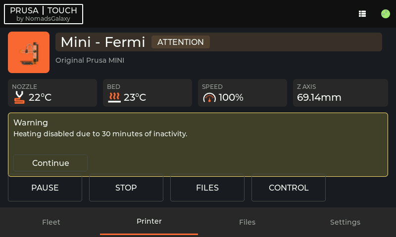
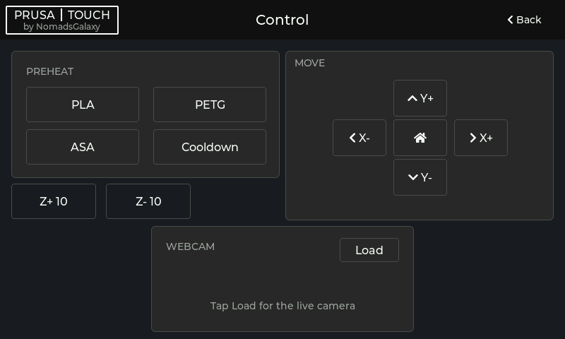
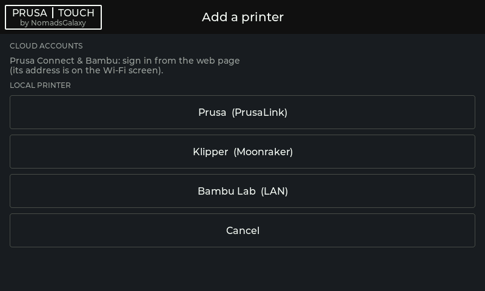
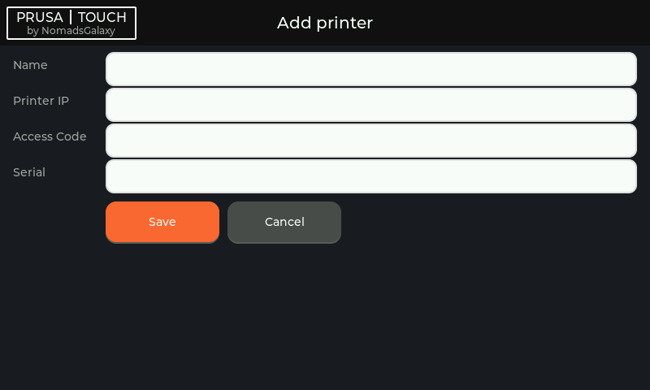
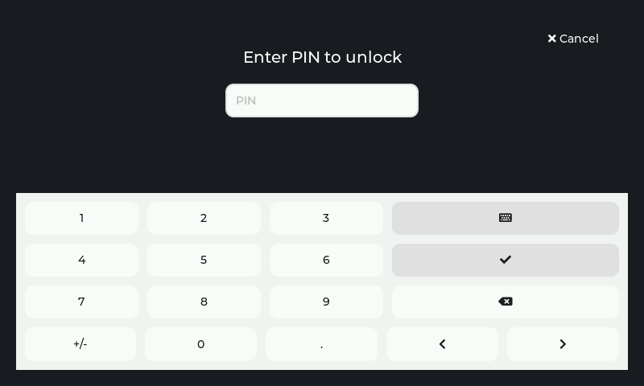
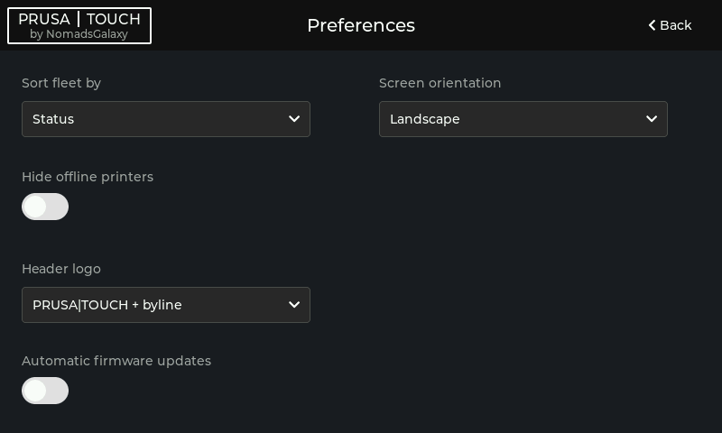
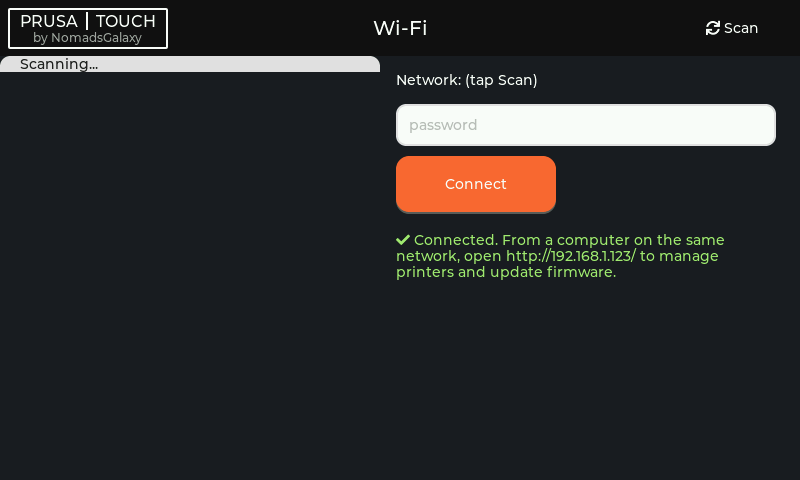
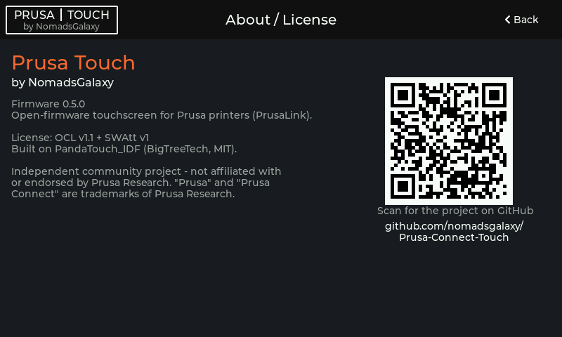
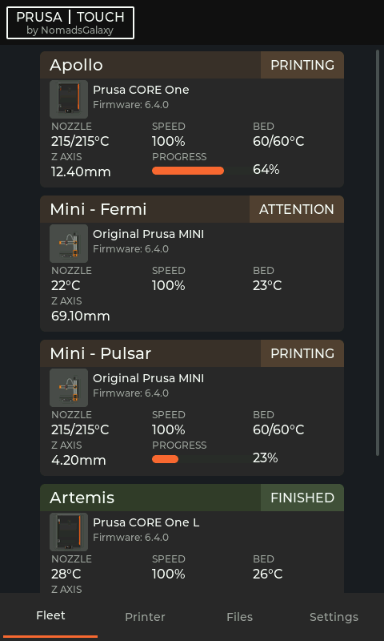
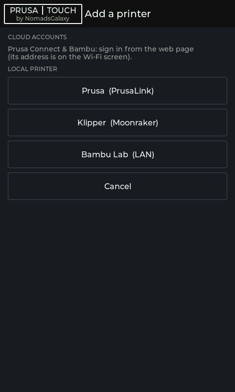

# Screenshots

These are rendered straight from the firmware's own UI code with the desktop
[simulator](../firmware/sim/) (`firmware/sim/`), so they match what the device draws on its
800×480 panel. The fleet shown is mock data for illustration.

## Fleet dashboard

Every printer at a glance — state, temperatures, progress, the model render, and the live job
thumbnail while a print runs. Cards refresh in place as values change.

## Printer detail

Tap a printer for the detail view: status badge, nozzle / heatbed / speed / Z, the current job,
and any needs-attention dialog (here, a heater-timeout warning) with the same buttons you'd see
in Prusa Connect.

## Control

Preheat presets, jog and home, and the live webcam slot. Controls a backend doesn't expose hide
themselves.

## Add a printer (guided)

One place to add machines: pick a **Cloud account** (Prusa or Bambu) or a **Local printer**
(Prusa / Klipper / Bambu), and only the fields that type needs appear.

Choosing **Bambu (LAN)** asks for the IP, LAN Access Code, and serial:

## Screen lock (opt-in)

After a few idle minutes the screen can lock; browsing the fleet stays available, but actions
ask for a PIN.

## Preferences

## Wi-Fi

On-device network onboarding, with the web-UI address once connected.

## About

## Portrait

The UI reflows for a portrait mount — the fleet drops to a single column and forms stack.

